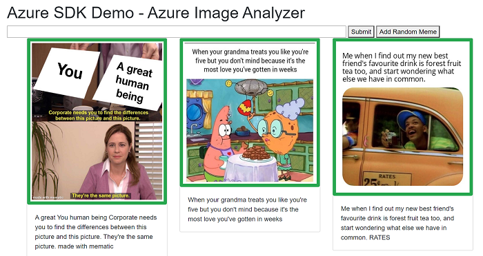
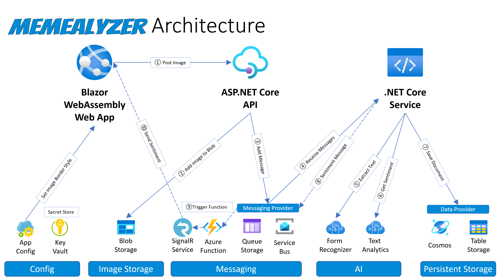
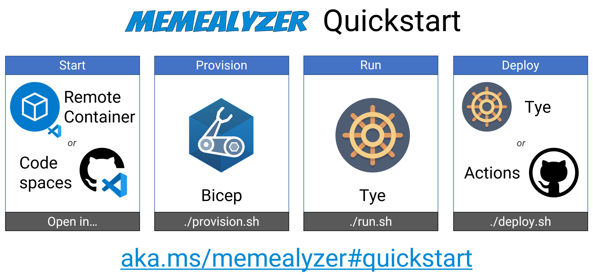

# Memealyzer

[](https://open.vscode.dev/jongio/memealyzer)
[](https://tinyurl.com/memealyzercodeinsiders)

## Meme + Analyzer = Memealyzer

Memealyzer determines if a meme's sentiment is positive, negative, or neutral. 

For example, given this meme:


Memealyzer will extract the text, analyize the sentiment of that text, and then change the border color to red for negative sentiment, green for positive, and yellow for neutral.



Memealyzer is an app built to demonstrate some the latest and greatest Azure tech to dev, debug, and deploy microservice applications, including:

- [Azure SDKs](https://aka.ms/azsdk) - to interact Azure services
- [Bicep](https://github.com/azure/bicep) & [Azure CLI](https://aka.ms/getazcli) - to provision Azure resources
- [Project Tye](https://github.com/dotnet/tye/) to dev, debug, and deploy the solution
- [Blazor](https://dotnet.microsoft.com/apps/aspnet/web-apps/blazor) - for a responsive client-side app built with .NET/C#.
- [Azure Functions](https://azure.microsoft.com/services/functions/) - to connect message queues with SignalR
- [Azure SignalR Service](https://azure.microsoft.com/services/signalr-service/) - to send messages to the web app

## Architecture



> This is the current .NET architecture - we are in the process of developing for other languages and architectures as well.

## Azure Resources

The following Azure resources are used in this application:

1. [Resource Group](https://docs.microsoft.com/azure/azure-resource-manager/management/overview#resource-groups)
1. [Storage Account](https://docs.microsoft.com/azure/storage/common/storage-introduction)
1. [Cognitive Services Form Recognizer](https://docs.microsoft.com/azure/cognitive-services/form-recognizer/overview)
1. [Cognitive Services Text Analytics](https://azure.microsoft.com/services/cognitive-services/text-analytics/)
1. [Cosmos DB](https://docs.microsoft.com/azure/cosmos-db/introduction)
1. [Key Vault](https://azure.microsoft.com/services/key-vault/)
1. [Azure Kubernetes Service](https://docs.microsoft.com/azure/aks/)
1. [Application Insights](https://docs.microsoft.com/azure/azure-monitor/app/app-insights-overview)
1. [Azure SignalR Service](https://azure.microsoft.com/services/signalr-service/)
1. [Azure Functions](https://azure.microsoft.com/services/functions/)
1. [Azure Service Bus](https://azure.microsoft.com/services/service-bus/)

> You can select the Data and Messaging Providers via environment variables.  See the ["Environment Variables"](#environment-variables) section below for more information.

## Quickstart

We follow a 4 step process to go from nothing to a completely deployed Azure solution.

1. **Start** Dev Environment with VS Code Remote Container (GitHub Codespaces coming soon)
1. **Provision** Azure Resources with Bicep
1. **Run** Locally with Tye
1. **Deploy** to Azure with Tye or GitHub Actions




> You will see `{BASENAME}` throughout this document.  Replace it with any unique text that you'd like, such as memealyzer007. That will be used as the basename for all your Azure resources, i.e. If you use memealyzer007, then the resource group will be named memealyzer007rg.


> We use the Azure CLI to perform resource deployment and configuration. The scripts below will automatically prompt you to login to the Azure CLI and set your active Azure subscription. You can set the `AZURE_SUBSCRIPTION_ID` environment variable in the `.env` file if you don't want to be prompted every time you run these scripts.

### 1. Start Dev Environment
The fastest way to get to get the Memealyzer dev machine setup is to use the Codespaces Dev Container which includes all of your development dependencies.

   1. Install [VS Code](https://code.visualstudio.com)
   1. Install [VS Code - Remote Containers Extension](https://marketplace.visualstudio.com/items?itemName=ms-vscode-remote.remote-containers)
   1. Open a Linux shell, such as bash or WSL bash
   1. Clone the repo: 
      - `git clone https://github.com/jongio/memealyzer`
   1. Open the repo in VS Code `code memealyzer`
   1. Hit F1, then select "Remote Containers - Open Folder in Container"
   1. Select the memealyzer root folder and click the Open button.

   > It can take a while to open the Dev Container the first time, but subsequent opens will load much faster.

### 2. Provision Azure Resources

   This will provision all the required Azure resources with Bicep.

   - `./provision.sh {BASENAME}`
   
   > It may take up to 30 minutes to provision all resources.

   You can deprovision at any time with `./deprovision.sh {BASENAME}`

### 3. Run Locally

   Now that our Azure Resources are provisioned, we'll now use Tye to run our application locally.

   1. `./run.sh {BASENAME}`
   1. Open the Tye dashboard: http://localhost:8000 and ensure that all services are running.
      > The Azure Function takes a few minutes to start, so if you get an error while loading the app, then wait a few minutes before trying again.
   1. Open http://localhost:1080
   1. You can add memes by clicking on the "+" button
   1. You can start the memestream by clicking on the "&#8734;" button. This will add a new meme every 5 seconds.

   > If you get build errors, then CD to `./src/net` and run `./clean.sh` to clean up the .NET dirs.

   > If the app doesn't start correctly, then stop using CTRL+C and re-run the run.sh command.  We are researching why this happens.

### 4. Deploy to Azure

   Now that we've provisioned our resources and tested locally, it is time to deploy our code to Azure with Tye.

   1. `./deploy.sh {BASENAME}`
   1. Click on the link that is outputted to the console - this address will be unique to your deployment.

   > Please also take a look at the GitHub Action in the .github/workflows folder to see how we are auto-deploying this to an environment.

## VS Code Workspace

   Execute the following command to open the VS Code workspace that has all the projects you need to get started:

   `code memealyzer-net.code-workspace`

   or

   `code-insiders memealyzer-net.code-workspace` if you are using VS Code Insiders build.

## Manual Dev Machine Setup

We recommend using a VS Code Dev Container, but you can setup on bare metal with these steps.

1. Terminal - WSL2, Zsh, GitBash, PowerShell, not Windows Command prompt as this application uses bash script files.  
1. [Azure CLI](https://aka.ms/azcliget) - v2.20.0+
1. [Git](https://git-scm.com/downloads) 
1. [VS Code](https://code.visualstudio.com/)
1. [Docker](https://docs.docker.com/get-docker/)
1. [Kubectl](https://kubernetes.io/docs/tasks/tools/install-kubectl/)
1. [.NET SDK](https://dotnet.microsoft.com/download) - 5.0
1. [Azure Functions Core Tools](https://docs.microsoft.com/azure/azure-functions/functions-run-local) - v3.0.2881 minimum
1. [Project Tye](https://github.com/dotnet/tye/blob/master/docs/getting_started.md)
1. [Bicep](https://github.com/Azure/bicep/blob/main/docs/installing.md) - `az bicep install`
1. [Playwright - Test Automation](https://playwright.dev/docs/intro/) - Install Playwright via npm and run this to install dependencies: `npx playwright install-deps`


## Troubleshooting

1. Error while loading WebApp

If you see this error:
```bash
A fatal error was encountered. The library 'libhostpolicy.so' required to execute the application was not found in './src/net/WebApp/bin/Debug/net5.0/'.
```

Then stop running the soltion and run it again.  We do not know why this occasionally happens.

2. Error while building or running

If you see this error:
```bash
/opt/dotnet/5.0.100/sdk/5.0.100/Microsoft.Common.CurrentVersion.targets(4354,5): error MSB3021: Unable to copy file "obj/Debug/netstandard2.1/Lib.Model.dll" to "bin/Debug/netstandard2.1/Lib.Model.dll". Access to the path is denied. [/home/codespace/workspace/src/net/Libs/Lib.Model/Lib.Model.csproj]
```

Option 1: Run this from within the devcontainer to take ownership of the files: `sudo chown -R codespace ~/workspace/src`
Option 2: CD to `./src/net` and run `./clean.sh` to clean up the .NET dirs.

## Configuration

### Data Provider

You can configure which store the app uses to persist your image metadata, either Cosmos DB or Azure Table Storage.

1. Open `.env` file that is in the root of this project.
1. Find or add the `AZURE_STORAGE_TYPE` setting
1. Set it to one of the following values:
   - `COSMOS_SQL` - This will instruct the app to use Cosmos DB.
   - `STORAGE_TABLE` - This will instruct the app to use Azure Storage Tables.

### Cosmos Emulator

You can now use the Cosmos Emulator instead of Azure Cosmos. Follow these steps to enable the emulator, which will tell the `./run.sh` and `./debug.sh` scripts to run the cosmos-emulator container.  See, `./scripts/cosmos.sh` for details.

1. Open `.env` file that is in the root of this project.
1. Scroll to bottom and uncomment `USE_COSMOS_EMULATOR=true`
1. Use the `./run.sh` and other commands as you normally would and the Cosmos Emulator will be used.

#### Troubleshooting
1. You may see this error message when starting the emulator: `Error: failed to start containers: cosmos-emulator`, which is likely a false-negative and can be ignored.
1. If you see this error while trying to run the app, then remove the container using docker tools and re-start memealyzer.

   `The remote certificate is invalid because of errors in the certificate chain: UntrustedRoot`

### Azure Storage Emulation (Azurite)

You can locally emulate all three Azure Storage services: Blobs, Queues, and Tables with [Azurite](https://github.com/Azure/Azurite).

To emulate all three of them, all you need to do is set the `USE_AZURITE` environment variable in the `.env` file to `true`.  You can also enable or disable each individual service emulation with the following settings:

- `USE_AZURITE` - Enables emulation for all three.
- `USE_AZURITE_BLOB` - Enables emulation for blobs only.
- `USE_AZURITE_QUEUE` - Enables emulation for queues only.
- `USE_AZURITE_TABLE` - Enables emulation for tables only.

#### Ngrok Tunnel to Azurite

When Azurite is enabled, an Ngrok tunnel is created to the blob and queue endpoints.  This is done because: 
1. The Form Recognizer client requires a publically addressable endpoint to read the blob from
2. The Azure Function Queue binding requires a queue that is also public.

See the `Lib.Tunnel` project for more information.

Ngrok is the only currently supported tunneling client, but we may consider adding alternatives in the future.


By default Ngrok has very aggressive throttling for the free account and it will often throttle requests from the Storage Queue Function.  For this reason, do not use the "Meme Stream" feature and do not aggresively add memes while using Azurite/Ngrok.  For this reason we have added the `AZURE_STORAGE_QUEUE_MAX_POLLING_INTERVAL` config setting that allows you to specify how long the function should wait before polling the queue for new messages. The default is set to 10 seconds, but this still will not prevent you from being throttled if you add a lot of memes at once.

If you have a paid account, then you can specify your auth token in the `NGROK_AUTHTOKEN` environment variable in this format `--authtoken yourtoken`.

> Note that Azurite and Ngrok run over HTTP, not HTTPS so if you adopt this pattern in your application, then ensure you are not transporting any sensitive data in your application.

### Messaging Provider

You can configure which messaging service you want to use, either Service Bus Queue or Azure Storage Queue.

1. Open `.env` file that is in the root of this project.
1. Find or add the `AZURE_MESSAGING_TYPE` setting
1. Set it to one of the following values:
   - `SERVICE_BUS_QUEUE` - This will instruct the app to use Service Bus Queue.
   - `STORAGE_QUEUE` - This will instruct the app to use Azure Storage Queue.

### Border Style

You can configure the image border style with the Azure App Configuration service. It will default to `solid`, but you can change it to any valid [CSS border style](https://www.w3schools.com/css/css_border.asp). You can either do this in the Azure Portal, or via the Azure CLI with this command:

```bash
az appconfig kv set -y -n {BASENAME}appconfig --key borderStyle --value dashed
```

After you change the setting, reload the WebApp to see the new style take effect.

### Environment Variables

You can add override any of the following environment variables to suit your needs. Memealyzer chooses smart defaults that match what is created when you deploy the app.

|Name |Default Value|Allowed Values|
|---|---|---|
|BASENAME|This will be populated from the first argument you pass to scripts, such as `./run.sh meme01`||
|AZURE_SUBSCRIPTION_ID|The subscription that you want to use for your app.||
|AZURE_COSMOS_ENDPOINT|https://${BASENAME}cosmosaccount.documents.azure.com:443||
|AZURE_COSMOS_KEY|Default value in .env files||
|USE_COSMOS_EMULATOR|Set to true to enable Cosmos Emulator|false|
|AZURE_COSMOS_DB|memealyzer||
|AZURE_COSMOS_COLLECTION|images||
|AZURE_COSMOS_KEY_SECRET_NAME|CosmosKey||
|AZURE_COSMOS_THROUGHPUT|400||
|USE_AZURITE|Set this to true to use Azurite for Tables, Blobs, and Queue|false|
|USE_AZURITE_BLOB|Set this to true to use Azurite for Blob|false|
|USE_AZURITE_QUEUE|Set this to true to use Azurite for Queue|false|
|USE_AZURITE_TABLE|Set this to true to use Azurite for Table|false|
|AZURITE_ACCOUNT_KEY|devstoreaccount1||
|AZURITE_CONNECTION_STRING|Default value in Config.cs||
|AZURITE_PROXY_CONNECTION_STRING|The Azurite connection string with the Tunnel endpoints.||
|NGROK_URI|Default value is read at runtime from localhost:4040||
|AZURE_FORM_RECOGNIZER_ENDPOINT|https://${BASENAME}fr.cognitiveservices.azure.com/||
|AZURE_KEYVAULT_ENDPOINT|https://${BASENAME}kv.vault.azure.net/||
|AZURE_STORAGE_ACCOUNT_NAME|${BASENAME}storage||
|AZURE_STORAGE_BLOB_ACCOUNT_NAME|${BASENAME}storage||
|AZURE_STORAGE_QUEUE_ACCOUNT_NAME|${BASENAME}storage||
|AZURE_STORAGE_TABLE_ACCOUNT_NAME|${BASENAME}storage||
|AZURE_STORAGE_BLOB_ENDPOINT|https://${BASENAME}storage.blob.core.windows.net/||
|AZURE_STORAGE_QUEUE_ENDPOINT|https://${BASENAME}storage.queue.core.windows.net/||
|AZURE_STORAGE_TABLE_ENDPOINT|https://${BASENAME}storage.table.core.windows.net/||
|AZURE_STORAGE_QUEUE_MAX_POLLING_INTERVAL|"00:00:10"||
|AZURE_TEXT_ANALYTICS_ENDPOINT|https://${BASENAME}ta.cognitiveservices.azure.com/||
|AZURE_APP_CONFIG_ENDPOINT|https://${BASENAME}appconfig.azconfig.io||
|AZURE_CONTAINER_REGISTRY_SERVER|${BASENAME}acr.azurecr.io||
|AZURE_SERVICE_BUS_NAMESPACE|{BaseName}sb.servicebus.windows.net||
|AZURE_STORAGE_BLOB_CONTAINER_NAME|blobs||
|AZURE_MESSAGES_QUEUE_NAME|messages||
|AZURE_STORAGE_QUEUE_MSG_COUNT|10||
|AZURE_STORAGE_QUEUE_RECEIVE_SLEEP|1 second||
|AZURE_STORAGE_TABLE_NAME|images||
|AZURE_STORAGE_TYPE|COSMOS_SQL|COSMOS_SQL, STORAGE_TABLE|
|AZURE_MESSAGING_TYPE|SERVICE_BUS_QUEUE|SERVICE_BUS_QUEUE, STORAGE_QUEUE|
|AZURE_CLIENT_SYNC_QUEUE_NAME|sync||
|IMAGE_ENDPOINT|https://meme-api.herokuapp.com/gimme/wholesomememes||
|TUNNEL_TYPE|NGROK|NGROK|
|NGROK_AUTHTOKEN|Needs to have --authtoken and then your token||
